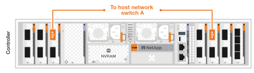
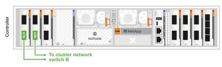
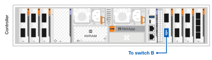
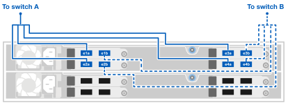
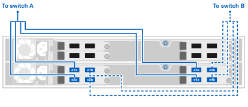

= AFX 2K 스토리지 시스템의 하드웨어 케이블 연결
:allow-uri-read: 
:icons: font
:imagesdir: ../media/

[role="lead"]
AFX 2K 스토리지 시스템의 랙 하드웨어를 설치한 후 컨트롤러용 네트워크 케이블을 설치하고 컨트롤러와 스토리지 쉘프 간의 케이블을 연결하십시오.

.시작하기 전에
스토리지 시스템을 네트워크 스위치에 연결하는 방법에 대한 자세한 내용은 네트워크 관리자에게 문의하세요.

.이 작업에 관하여
* 다음 절차는 일반적인 구성을 보여줍니다.  구체적인 케이블 연결은 스토리지 시스템을 위해 주문한 구성 요소에 따라 달라집니다.  포괄적인 구성 세부 정보 및 슬롯 우선 순위는 다음을 참조하세요.link:https://hwu.netapp.com["NetApp Hardware Universe"^] .
* AFX 2K 컨트롤러의 I/O 슬롯은 1번부터 11번까지 번호가 매겨져 있습니다.
+
image::../media/drw_afx_2k_rear_slots_ieops-2862.svg[AFX 컨트롤러의 슬롯 번호 매기기]

+
[cols="10%,23%,10%,24%,10%,23%"]
|===
| 슬롯 번호 | 입출력 슬롯 | 슬롯 번호 | 입출력 슬롯 | 슬롯 번호 | 입출력 슬롯 

 a| 

| HA  a| 
image::../media/icon_round_4.svg[설명선 번호 4]

| NVRAM12  a| 
image::../media/icon_round_9.svg[설명선 번호 9]
| 네트워크 

 a| 

| 무리  a| 
image::../media/icon_round_6.svg[설명선 번호 6]

image::../media/icon_round_7.svg[설명선 번호 7]
| NVRAM12-EX  a| 
image::../media/icon_round_10.svg[설명선 번호 10]
| 스토리지 

 a| 
image::../media/icon_round_3.svg[설명선 번호 3]
| 네트워크  a| 
image::../media/icon_round_8.svg[설명선 번호 8]
| 스토리지  a| 
image::../media/icon_round_11.svg[설명선 번호 11]
| (*선택 사항*) 추가 관리 연결을 위한 4포트 25GbE SFP28 
|===
* 케이블 그래픽은 커넥터를 포트에 삽입할 때 케이블 커넥터 당김 탭의 올바른 방향(위 또는 아래)을 나타내는 화살표 아이콘을 보여줍니다.
+
커넥터를 삽입할 때 딸깍 소리가 나야 합니다. 소리가 나지 않으면 커넥터를 제거하고 뒤집어서 다시 시도하세요.

+
image:../media/drw_cable_pull_tab_direction_ieops-1699.svg["케이블 당김 탭 방향"]

+
[NOTE]
====
커넥터 구성 요소는 섬세하므로 제자리에 끼울 때 주의해야 합니다.

====
* 광섬유 연결에 케이블을 연결할 때 스위치 포트에 케이블을 연결하기 전에 광 트랜시버를 컨트롤러 포트에 삽입하세요.
* AFX 2K 스토리지 시스템은 400GbE 케이블을 사용합니다.  400GbE 연결은 컨트롤러와 스위치 간에 이루어집니다.  스토리지 쉘프와 스위치 간의 연결에는 4x100GbE 브레이크아웃 케이블이 사용되며, 100GbE 연결은 드라이브 쉘프 포트에 연결됩니다.
+
쉘프 스토리지 연결은 스위치의 모든 100GbE 브레이크아웃 포트에 연결할 수 있습니다. HA/클러스터 연결은 스위치의 모든 400GbE 포트에 연결할 수 있습니다. 모든 "a" 컨트롤러 포트는 스위치 A에 연결되고, 모든 "b" 컨트롤러 포트는 스위치 B에 연결됩니다.

== 1단계: 컨트롤러를 관리 네트워크에 연결합니다.

각 컨트롤러의 관리(렌치) 포트를 관리 스위치 중 하나에 연결하거나 관리 네트워크에 직접 연결하십시오.

1000BASE-T RJ-45 케이블을 사용하여 각 컨트롤러의 관리(렌치) 포트를 관리 네트워크 스위치에 연결합니다.

image::../media/oie_cable_rj45.png[RJ-45 케이블]

*1000BASE-T RJ-45 케이블*

image::../media/drw_afx_2k_management_connection_ieops-2863.svg[관리 네트워크에 연결하세요]

IMPORTANT: 아직 전원 코드를 꽂지 마세요.

.단계
. 관리 네트워크에 연결합니다.

== 2단계: 컨트롤러를 호스트 네트워크에 연결합니다.

이더넷 모듈 포트를 호스트 네트워크에 연결합니다.

이 절차는 I/O 모듈 구성에 따라 다를 수 있습니다.  다음은 일반적인 호스트 네트워크 케이블링의 예입니다.  보다link:https://hwu.netapp.com["NetApp Hardware Universe"^] 귀하의 특정 시스템 구성에 맞게.

.단계
. 다음 포트를 이더넷 데이터 네트워크 스위치 A에 연결합니다.
+
** 컨트롤러
+
*** e3a
*** e9a
+
*400GbE 케이블*

+

+

. 다음 포트를 이더넷 데이터 네트워크 스위치 B에 연결합니다.
+
** 컨트롤러
+
*** e3b
*** e9b
+
*400GbE 케이블*

+

+
image::../media/drw_afx_2k_host_switch_b_ieops-2865.svg[케이블-이더넷 네트워크]

== 3단계: 클러스터 및 HA 연결 케이블 연결

클러스터 및 HA 인터커넥트 케이블을 사용하여 포트 e1a와 e2a를 스위치 A에, e1b와 e2b를 스위치 B에 연결하십시오. e1a/e1b 포트는 HA 연결에 사용되고, e2a/e2a 포트는 클러스터 연결에 사용됩니다.

.단계
. 다음 컨트롤러 포트를 클러스터 네트워크 스위치 A의 ISL 포트가 아닌 포트에 연결하십시오.
+
** 컨트롤러
+
*** e1a(HA)
*** e2a (클러스터)
+
*400GbE 케이블*

+
image::../media/oie_cable_25Gb_Ethernet_SFP28_ieops-1069.png[클러스터 HA 케이블]

+
image::../media/drw_afx_2k_cluster_switch_a_ieops-2866.svg[클러스터 네트워크에 대한 케이블 클러스터 연결]

. 다음 컨트롤러 포트를 클러스터 네트워크 스위치 B의 ISL 포트가 아닌 포트에 연결하십시오.
+
** 컨트롤러
+
*** e1b(HA)
*** e2b (클러스터)
+
*400GbE 케이블*

+
image::../media/oie_cable_25Gb_Ethernet_SFP28_ieops-1069.png[클러스터 HA 케이블]

+

== 4단계: 컨트롤러-스위치 스토리지 연결 케이블 연결

컨트롤러 스토리지 포트를 스위치에 연결하십시오. 스위치에 맞는 케이블과 커넥터를 사용하고 있는지 확인하십시오. 자세한 내용은 https://hwu.netapp.com["Hardware Universe"^]을 참조하십시오.

NOTE: 컨트롤러의 e10b 및 e8a 포트는 AFX 2K 스토리지 시스템 구성에서 스토리지 연결에 사용되지 않습니다.

.단계
. 다음 스토리지 포트를 스위치 A의 ISL 포트가 아닌 아무 포트에 연결하십시오.
+
** 컨트롤러
+
*** e10a
+
*400GbE 케이블*

+

+
image::../media/drw_afx_2k_storage_connection_a_ieops-2868.svg[케이블 컨트롤러 스토리지를 스위치 A에 연결]

. 다음 스토리지 포트를 스위치 B의 ISL 포트가 아닌 아무 포트에 연결하십시오.
+
** 컨트롤러
+
*** e8b
+
*400GbE 케이블*

+

+

== 5단계: 선반-스위치 연결 케이블 연결

NX224 스토리지 쉘프를 스위치의 100GbE 브레이크아웃 포트에 연결합니다.

스토리지 시스템에서 지원하는 최대 선반 수와 모든 케이블 옵션에 대해서는 다음을 참조하세요.link:https://hwu.netapp.com["NetApp Hardware Universe"^] .

.단계
. 모듈 A의 경우, 다음 쉘프 포트를 스위치 A와 스위치 B의 브레이크아웃 포트 중 하나에 연결하십시오.
+
** 모듈 A에서 A 연결로 전환
+
*** e1a
*** e2a
*** e3a
*** e4a

** 모듈 A에서 스위치 B로의 연결
+
*** e1b
*** e2b
*** e3b
*** e4b
+
*100GbE 케이블*

+

+

. 모듈 B의 경우 다음 쉘프 포트를 스위치 A와 스위치 B의 브레이크아웃 포트 중 하나에 연결하십시오.
+
** 모듈 B를 A 연결로 전환
+
*** e1a
*** e2a
*** e3a
*** e4a

** 모듈 B를 B 연결로 전환
+
*** e1b
*** e2b
*** e3b
*** e4b
+
*100GbE 케이블*

+

+

.다음은 무엇인가요?
하드웨어 케이블링 후,link:power-on-configure-switch.html["전원을 켜고 스위치를 구성하세요"] .
