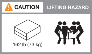
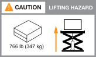

= AFX 2K 스토리지 시스템 설치 요구 사항
:allow-uri-read: 
:icons: font
:imagesdir: ../media/

[role="lead"]
AFX 2K 스토리지 컨트롤러 및 스토리지 쉘프에 필요한 장비와 들어올리기 시 주의 사항을 검토하십시오.

== 설치에 필요한 장비

AFX 2K 스토리지 시스템을 설치하려면 다음과 같은 장비와 도구가 필요합니다.

* 저장 시스템을 구성하기 위한 웹 브라우저 접속
* 정전기 방전(ESD) 스트랩
* 플래시
* USB/직렬 연결이 가능한 노트북 또는 콘솔
* 보관 선반 ID를 설정하기 위한 종이 클립 또는 좁은 팁 볼펜
* 필립스 #2 드라이버

== 리프팅 시 주의사항

AFX 스토리지 컨트롤러와 스토리지 선반은 무겁습니다.  이런 품목을 들어올리거나 옮길 때는 주의하세요.

=== 스토리지 컨트롤러 무게

AFX 2K 스토리지 컨트롤러를 이동하거나 들어 올릴 때 필요한 주의 사항을 따르십시오.

AFX 2K 스토리지 컨트롤러는 최대 64.0lb(29.03kg)까지 나갈 수 있습니다. 스토리지 컨트롤러를 들어 올리려면 두 사람이 함께 들거나 유압 리프트를 사용하십시오.

.AFX 2K 컨트롤러를 들어 올릴 때 주의 사항.
image::../media/drw_afx_2k_weight_caution_ieops-2938.svg[AFX 2K 컨트롤러 리프팅 경고 아이콘]

=== 보관 선반 무게

선반을 옮기거나 들어 올릴 때는 필요한 예방 조치를 취하세요.

.NX224 선반
NX224 쉘프의 무게는 최대 60.1lb(27.3kg)입니다. 쉘프를 들어 올릴 때는 두 사람이 함께 들거나 유압 리프트를 사용하십시오. 쉘프의 무게 균형이 맞지 않는 것을 방지하기 위해 모든 구성품(앞쪽과 뒤쪽 모두)을 쉘프 안에 넣어 두십시오.

.NX224 쉘프 들어 올리기 주의 사항.
image::../media/drw_nx224_lifting_weight_ieops-2437.svg[NX224 NSM100 리프팅 주의 아이콘]

=== 스위치 웨이트

스위치를 이동하거나 들어 올릴 때는 필요한 예방 조치를 취하십시오.

.Cisco Nexus 9808
빈 상태의 Cisco 9808은 최대 link:https://www.cisco.com/c/en/us/products/collateral/switches/nexus-9000-series-switches/nexus9800-series-switches-ds.html#Productspecifications["무게는 162파운드(73kg)이며, 완전히 적재된 Cisco 9808 스위치는 최대 766파운드(347kg)까지 나갈 수 있습니다."^] 무게가 나갈 수 있습니다. 스위치를 들어 올리려면 유압 리프트를 사용하십시오.

.하역된 Cisco Nexus 9808 리프팅 시 주의 사항.

.완전히 적재된 Cisco Nexus 9808 들어 올리기 주의 사항.

.Cisco Nexus9332D-GX2B
Cisco 9332D-GX2B의 무게는 최대 link:https://www.cisco.com/c/en/us/td/docs/dcn/hw/aci/nexus9000/9332d-gx2b/cisco-nexus-9332d-gx2b-aci-mode-switch-hardware-installation-guide/m_n93xxx_system_specs.html["12.7 kg (28.1 lb)"^]입니다.

.Cisco Nexus 9364D-GX2A
Cisco Nexus 9364D-GX2A 스위치는 최대 link:https://www.cisco.com/c/en/us/td/docs/dcn/hw/nx-os/nexus9000/9364d-gx2a/cisco-nexus-9364d-gx2a-nx-os-mode-switch-hardware-installation-guide/m_n93xxx_system_specs.html["58lb(26.3kg)"^]의 무게가 나갈 수 있습니다. 스위치를 들어 올리려면 두 사람이 필요하거나 유압 리프트를 사용하십시오.

.Cisco Nexus 9364D-GX2A 리프팅 시 주의사항.
image::../media/drw_afx_2k_9364d_weight_caution_ieops-2942.svg[Cisco Nexus 9364D-GX2A 리프팅 주의 아이콘]

.관련 정보
* https://library.netapp.com/ecm/ecm_download_file/ECMP12475945["안전 정보 및 규정 고지 사항"^]

.다음은 무엇인가요?
하드웨어 요구 사항을 검토한 후 link:prepare-hardware.html["AFX 2K 스토리지 시스템 설치 준비"].
