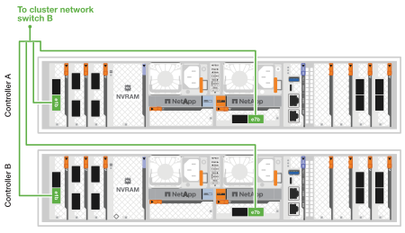

= AFX 1K 스토리지 시스템용 하드웨어 케이블 연결
:allow-uri-read: 
:icons: font
:imagesdir: ../media/

[role="lead"]
AFX 1K 스토리지 시스템용 랙 하드웨어를 설치한 후, 컨트롤러용 네트워크 케이블을 설치하고 컨트롤러와 스토리지 선반 사이에 케이블을 연결합니다.

.시작하기 전에
스토리지 시스템을 네트워크 스위치에 연결하는 방법에 대한 자세한 내용은 네트워크 관리자에게 문의하세요.

.이 작업에 관하여
* 다음 절차는 일반적인 구성을 보여줍니다.  구체적인 케이블 연결은 스토리지 시스템을 위해 주문한 구성 요소에 따라 달라집니다.  포괄적인 구성 세부 정보 및 슬롯 우선 순위는 다음을 참조하세요.link:https://hwu.netapp.com["NetApp Hardware Universe"^] .
* AFX 컨트롤러의 I/O 슬롯은 1부터 11까지 번호가 매겨져 있습니다.
+
image::../media/drw_a1K_back_slots_labeled_ieops-2162.svg[AFX 컨트롤러의 슬롯 번호 매기기]

* 케이블 그래픽은 커넥터를 포트에 삽입할 때 케이블 커넥터 당김 탭의 올바른 방향(위 또는 아래)을 나타내는 화살표 아이콘을 보여줍니다.
+
커넥터를 삽입할 때 딸깍 소리가 나야 합니다. 소리가 나지 않으면 커넥터를 제거하고 뒤집어서 다시 시도하세요.

+
image:../media/drw_cable_pull_tab_direction_ieops-1699.svg["케이블 당김 탭 방향"]

+
[NOTE]
====
커넥터 구성 요소는 섬세하므로 제자리에 끼울 때 주의해야 합니다.

====
* 광섬유 연결에 케이블을 연결할 때 스위치 포트에 케이블을 연결하기 전에 광 트랜시버를 컨트롤러 포트에 삽입하세요.
* AFX 1K 스토리지 시스템은 클러스터와 스토리지 네트워크에서 4x100GbE 브레이크아웃 케이블을 활용합니다.  400GbE 연결은 스위치 포트에 이루어지고, 100GbE 연결은 컨트롤러 및 드라이브 쉘프 포트에 이루어집니다.  스토리지 및 HA/클러스터 연결은 스위치의 ISL이 아닌 모든 포트에 이루어질 수 있습니다.
+
특정 스위치 포트에 4x100GbE 브레이크아웃 케이블을 연결하는 경우, 스위치로 가는 4개 포트를 모두 이 단일 브레이크아웃 케이블을 통해 연결합니다.

+
** 1 x HA 포트(슬롯 1)
** 1 x 클러스터 포트(슬롯 7)
** 2개의 저장 포트(슬롯 10, 11)
+
모든 'a' 포트는 스위치 A에 연결되고, 모든 'b' 포트는 스위치 B에 연결됩니다.

NOTE: Cisco Nexus 9332D-GX2B 및 9364D-GX2A 스위치 구성을 AFX 1K 스토리지 시스템에 연결하려면 4x100GbE 브레이크아웃 케이블 연결이 필요합니다.

== 1단계: 컨트롤러를 관리 네트워크에 연결합니다.

각 스위치의 관리 포트를 관리 스위치 중 하나에 연결하거나(주문한 경우) 관리 네트워크에 직접 연결합니다.

관리 포트는 스위치의 PSU 쪽에 위치한 오른쪽 상단 포트입니다.  각 스위치의 CAT6 케이블은 스위치를 설치한 후 패스스루 패널을 통해 라우팅하여 관리 스위치나 관리 네트워크에 연결해야 합니다.

1000BASE-T RJ-45 케이블을 사용하여 각 컨트롤러의 관리(렌치) 포트를 관리 네트워크 스위치에 연결합니다.

image::../media/oie_cable_rj45.png[RJ-45 케이블]

*1000BASE-T RJ-45 케이블*

image::../media/drw_afx_management_connection_ieops-2349.svg[관리 네트워크에 연결하세요]

IMPORTANT: 아직 전원 코드를 꽂지 마세요.

. 호스트 네트워크에 연결합니다.

== 2단계: 컨트롤러를 호스트 네트워크에 연결합니다.

이더넷 모듈 포트를 호스트 네트워크에 연결합니다.

이 절차는 I/O 모듈 구성에 따라 다를 수 있습니다.  다음은 일반적인 호스트 네트워크 케이블링의 예입니다.  보다link:https://hwu.netapp.com["NetApp Hardware Universe"^] 귀하의 특정 시스템 구성에 맞게.

.단계
. 다음 포트를 이더넷 데이터 네트워크 스위치 A에 연결합니다.
+
** 컨트롤러 A (예)
+
*** e2a
*** e3a

** 컨트롤러 B (예)
+
*** e2a
*** e3a
+
*100GbE 케이블*

+
image::../media/oie_cable100_gbe_qsfp28.png[100Gb 이더넷 케이블]

+
image::../media/drw_afx_network_cabling_a_ieops-2350.svg[케이블-이더넷 네트워크]

. 다음 포트를 이더넷 데이터 네트워크 스위치 B에 연결합니다.
+
** 컨트롤러 A (예)
+
*** e2b
*** e3b

** 컨트롤러 B (예)
+
*** e2b
*** e3b
+
*100GbE 케이블*

+
image::../media/oie_cable100_gbe_qsfp28.png[100Gb 이더넷 케이블]

+
image::../media/drw_afx_network_cabling_b_ieops-2351.svg[케이블-이더넷 네트워크]

== 3단계: 클러스터 및 HA 연결 케이블 연결

클러스터와 HA 상호 연결 케이블을 사용하여 포트 e1a와 e7a를 스위치 A에 연결하고, e1b와 e7b를 스위치 B에 연결합니다. e1a/e1b 포트는 HA 연결에 사용되고, e7a/e7b 포트는 클러스터 연결에 사용됩니다.

.단계
. 다음 컨트롤러 포트를 클러스터 네트워크 스위치 A의 ISL이 아닌 포트에 연결합니다.
+
** 컨트롤러 A
+
*** e1a
*** e7a

** 컨트롤러 B
+
*** e1a
*** e7a
+
*100GbE 케이블*

+
image::../media/oie_cable_25Gb_Ethernet_SFP28_ieops-1069.png[클러스터 HA 케이블]

+

. 다음 컨트롤러 포트를 클러스터 네트워크 스위치 B의 ISL이 아닌 포트에 연결합니다.
+
** 컨트롤러 A
+
*** e1b
*** e7b

** 컨트롤러 B
+
*** e1b
*** e7b
+
*100GbE 케이블*

+
image::../media/oie_cable_25Gb_Ethernet_SFP28_ieops-1069.png[클러스터 HA 케이블]

+

== 4단계: 컨트롤러-스위치 스토리지 연결 케이블 연결

컨트롤러 스토리지 포트를 스위치에 연결합니다.  스위치에 맞는 케이블과 커넥터가 있는지 확인하세요. 보다 https://hwu.netapp.com["Hardware Universe"^] 자세한 내용은.

. 다음 스토리지 포트를 스위치 A의 ISL이 아닌 포트에 연결합니다.
+
** 컨트롤러 A
+
*** e10a
*** e11a

** 컨트롤러 B
+
*** e10a
*** e11a
+
*100GbE 케이블*

+
image::../media/oie_cable100_gbe_qsfp28.png[100Gb 케이블]

+
image::../media/drw_afx_controller_storage_cable_a_ieops-2354.svg[스위치 A에 케이블 컨트롤러 스토리지]

. 다음 스토리지 포트를 스위치 B의 ISL이 아닌 포트에 연결합니다.
+
** 컨트롤러 A
+
*** e10b
*** e11b

** 컨트롤러 B
+
*** e10b
*** e11b
+
*100GbE 케이블*

+
image::../media/oie_cable100_gbe_qsfp28.png[100Gb 케이블]

+
image::../media/drw_afx_controller_storage_cable_b_ieops-2355.svg[스위치 B에 케이블 컨트롤러 스토리지]

== 5단계: 선반-스위치 연결 케이블 연결

NX224 스토리지 선반을 스위치에 연결합니다.

스토리지 시스템에서 지원하는 최대 선반 수와 모든 케이블 옵션에 대해서는 다음을 참조하세요.link:https://hwu.netapp.com["NetApp Hardware Universe"^] .

. 모듈 A의 스위치 A와 스위치 B에 있는 ISL이 아닌 포트에 다음 셸프 포트를 연결합니다.
+
** 모듈 A에서 A 연결로 전환
+
*** e1a
*** e2a
*** e3a
*** e4a

** 모듈 A에서 스위치 B로의 연결
+
*** e1b
*** e2b
*** e3b
*** e4b
+
*100GbE 케이블*

+
image::../media/oie_cable100_gbe_qsfp28.png[100Gb 케이블]

+
image::../media/drw_afx_shelf_cabling_a_ieops-2356.svg[스위치 A와 스위치 B에 케이블 선반 설치]

. 모듈 B의 경우 다음 셸프 포트를 스위치 A와 스위치 B의 ISL이 아닌 포트에 연결합니다.
+
** 모듈 B를 A 연결로 전환
+
*** e1a
*** e2a
*** e3a
*** e4a

** 모듈 B를 B 연결로 전환
+
*** e1b
*** e2b
*** e3b
*** e4b
+
*100GbE 케이블*

+
image::../media/oie_cable100_gbe_qsfp28.png[100Gb 케이블]

+
image::../media/drw_afx_shelf_cabling_b_ieops-2357.svg[스위치 A와 스위치 B에 케이블 선반 설치]

.다음은 무엇인가요?
하드웨어 케이블링 후,link:power-on-configure-switch.html["전원을 켜고 스위치를 구성하세요"] .
