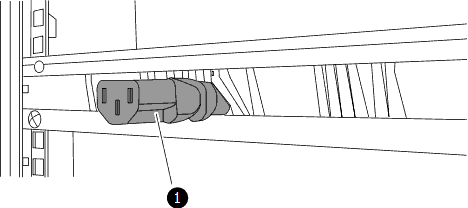

= AFX 1K 스토리지 시스템용 스위치 설치
:allow-uri-read: 
:icons: font
:imagesdir: ../media/

[role="lead"]
AFX 1K 스토리지 시스템 설치를 위한 준비를 완료한 후에는 캐비닛이나 통신 랙에 스위치를 설치해야 합니다.

캐비닛이나 랙에 Cisco Nexus 9332D-GX2B 또는 9364D-GX2A 스위치를 설치합니다.  Cisco Nexus 9364D-GX2A 스위치를 사용하는 경우 패스스루 패널 키트를 설치하세요.

.시작하기 전에
다음 구성 요소가 있는지 확인하세요.

* NetApp 에서 구입할 수 있는 패스스루 패널 키트(부품 번호 X8784-R6).
+
NetApp 패스스루 패널 키트에는 다음 하드웨어가 포함되어 있습니다.

+
** 1개의 통과 블랭킹 패널
** 10-32 x .75 나사 4개
** 10-32 클립 너트 4개

* 각 스위치에는 10-32 또는 12-24 나사 8개와 클립 너트가 있어 브래킷과 슬라이더 레일을 전면 및 후면 캐비닛 포스트에 장착할 수 있습니다.
* NetApp 캐비닛에 스위치를 설치하기 위한 Cisco 표준 레일 키트입니다.

NOTE: 점퍼 코드는 패스스루 키트에 포함되어 있지 않습니다.  스위치와 함께 점퍼 케이블이 제공되지 않은 경우 NetApp 에 ​​문의하여 올바른 점퍼 케이블을 주문하세요.

NOTE: 스위치의 공기 흐름이 포트 측 흡기(버건디색 팬 및 PSU)로 구성된 경우, 스위치의 네트워크 포트는 캐비닛 전면을 향하도록 설치해야 하며, 배기 팬은 캐비닛 후면을 향해야 합니다. 이 구성에서는 캐비닛 전면의 네트워크 포트에서 캐비닛 후면의 스토리지 포트까지 연결할 수 있을 만큼 충분히 긴 케이블을 사용해야 합니다. + 이러한 스위치에 대한 자세한 내용은 Cisco 웹사이트 https://www.cisco.com/c/en/us/td/docs/dcn/hw/nx-os/nexus9000/9332d-gx2b/cisco-nexus-9332d-gx2b-nx-os-mode-switch-hardware-installation-guide.html["Cisco Nexus 9332D-GX2B NX-OS 모드 스위치 하드웨어 설치 가이드"^] 및 https://www.cisco.com/c/en/us/td/docs/dcn/hw/nx-os/nexus9000/9364d-gx2a/cisco-nexus-9364d-gx2a-nx-os-mode-switch-hardware-installation-guide.html["Cisco Nexus 9364D-GX2A NX-OS 모드 스위치 하드웨어 설치 가이드"^]를 참조하십시오.

.단계
. 패스스루 블랭킹 패널을 설치합니다.
+
.. 캐비닛이나 랙에서 스위치와 블랭킹 패널의 수직 위치를 결정합니다.
.. 앞쪽 캐비닛 레일에 맞는 사각형 구멍에 양쪽에 클립 너트 두 개를 설치합니다.
.. 인접한 랙 공간을 침범하지 않도록 패널을 수직으로 중앙에 놓은 다음 나사를 조입니다.
.. 두 점퍼 코드의 암 커넥터를 패널 뒷면에서 브러시 어셈블리를 통해 삽입합니다.
+

+
[cols="1,4"]
|===

 a| 
image::../media/icon_round_1.png[콜아웃 번호 1]
 a| 
점퍼 코드의 암 커넥터.

|===

. 스위치 섀시에 랙 마운트 브래킷을 설치합니다.
+
.. 스위치 섀시의 한쪽 면에 전면 랙 장착 브래킷을 배치하여 장착 이어가 섀시 전면판(PSU 또는 팬 쪽)과 일직선이 되도록 한 다음, M4 나사 4개를 사용하여 브래킷을 섀시에 부착합니다.
+
image::../media/3132q_front_bracket.gif[프론트 브라켓]

.. 스위치 반대쪽에 있는 다른 전면 랙 마운트 브래킷으로 2a 단계를 반복합니다.
.. 스위치 섀시에 후면 랙 마운트 브래킷을 설치합니다.
.. 스위치 반대쪽에 있는 다른 후면 랙 마운트 브래킷으로 2c 단계를 반복합니다.

. 4개의 IEA 포스트 모두의 사각형 구멍 위치에 클립 너트를 설치합니다.
+
image::../media/ru_locations_for_3132q_v.gif[클립 너트 위치]

+
컨트롤러와 선반에 효율적으로 접근할 수 있는 캐비닛 위치(예: 가운데 줄)에 두 개의 9332D-GX2B 스위치를 장착합니다.

. 캐비닛이나 랙에 슬라이더 레일을 설치합니다.
+
.. 첫 번째 슬라이더 레일을 뒤쪽 왼쪽 기둥 뒷면의 원하는 위치에 놓고, 나사산 유형이 일치하는 나사를 삽입한 다음 손가락으로 나사를 조입니다.
+
image::../media/drw_3132q_v_slider_rails_ieops-2494.svg[슬라이더 레일 설치]

+
[cols="1,4"]
|===

 a| 
image::../media/icon_round_1.png[콜아웃 번호 1]
 a| 
슬라이더 레일을 조심스럽게 밀면서 랙의 나사 구멍에 맞춰 정렬하세요.

 a| 
image::../media/icon_round_2.png[콜아웃 번호 2]
 a| 
슬라이더 레일의 나사를 캐비닛 기둥에 조입니다.

|===
.. 오른쪽 뒷쪽 기둥에 대해서도 4a 단계를 반복합니다.
.. 캐비닛의 원하는 위치에서 4a와 4b 단계를 반복합니다.

. 캐비닛이나 랙에 스위치를 설치합니다.
+

NOTE: 이 단계에는 두 사람이 필요합니다. 한 사람은 앞쪽에서 스위치를 지지하고, 다른 한 사람은 스위치를 뒤쪽 슬라이더 레일로 안내합니다.

+
.. 스위치 뒷면을 캐비닛의 원하는 위치에 놓습니다.
+
image::../media/drw_switch_cabinet_position_generic_ieops-2348.svg[U39-40에 위치한 3232C]

+
[cols="1,4"]
|===

 a| 
image::../media/icon_round_1.png[콜아웃 번호 1]
 a| 
섀시가 후면 포스트 쪽으로 밀려나면서 두 개의 후면 랙 마운트 가이드를 슬라이더 레일에 맞춥니다.

 a| 
image::../media/icon_round_2.png[콜아웃 번호 2]
 a| 
앞쪽 랙 마운트 브래킷이 앞쪽 기둥과 같은 높이가 될 때까지 스위치를 부드럽게 밀어 넣습니다.

|===
.. 스위치를 캐비닛이나 랙에 부착합니다.
+
image::../media/3132q_attaching.gif[스위치 부착]

+
[cols="1,4"]
|===

 a| 
image::../media/icon_round_1.png[콜아웃 번호 1]
 a| 
한 사람이 섀시의 앞부분을 수평으로 잡고, 다른 사람은 캐비닛 기둥에 있는 네 개의 뒤쪽 나사를 완전히 조여야 합니다.

|===
.. 이제 섀시를 도움 없이 지지한 상태에서 앞쪽 나사를 기둥에 완전히 조입니다.
.. 캐비닛의 원하는 위치에 있는 두 번째 스위치에 대해 5a~5c 단계를 반복합니다.
+

NOTE: 완전히 설치된 스위치를 지지대로 사용하면 설치 과정에서 두 번째 스위치의 앞면을 잡을 필요가 없습니다.

. 스위치를 설치한 후 점퍼 코드를 스위치 전원 입력 단자에 연결합니다.
. 두 점퍼 코드의 수컷 플러그를 가장 가까운 PDU 콘센트에 연결합니다.
+

NOTE: 중복성을 유지하려면 두 개의 코드를 서로 다른 PDU에 연결해야 합니다.

. 각 스위치의 관리 포트를 관리 스위치 중 하나에 연결하거나(주문한 경우) 관리 네트워크에 직접 연결합니다.
+
관리 네트워크 포트는 오른쪽 PSU 근처의 아래쪽 RJ-45 포트입니다.  스위치를 설치한 후 각 스위치의 CAT6 케이블을 패스스루 패널을 통해 연결하여 관리 스위치나 네트워크에 연결합니다.

.다음은 무엇인가요?
캐비닛이나 랙에 스위치를 설치한 후link:deploy-hardware.html["캐비닛이나 랙에 AFX 1K 보관 시스템과 선반을 설치합니다."] .
